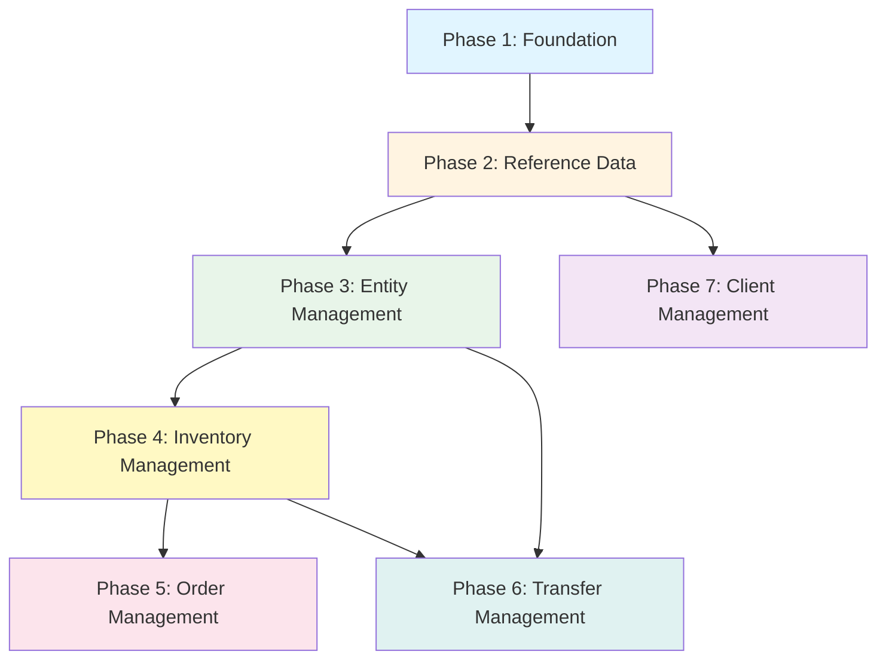

# Frontend Implementation Guide

## Table of Contents

1. [Introduction](#introduction)
2. [Prerequisites](#prerequisites)
3. [Implementation Phases](#implementation-phases)
4. [Dependencies Diagram](#dependencies-diagram)
5. [Screen Specifications](#screen-specifications)
6. [Component Library](#component-library)
7. [State Management](#state-management)
8. [API Integration Patterns](#api-integration-patterns)

## Introduction

This guide provides a step-by-step implementation plan for building the frontend application for the Bahaa-Eldin Inventory Management System. The guide is organized into phases that build upon each other, ensuring you implement features in the correct order based on their dependencies.

### Application Overview

The frontend application is a web-based inventory management system that allows users to:
- Manage branches, workshops, and factories
- Track inventory across multiple locations
- Manage clothing items and their status
- Process orders for clients
- Transfer clothes between entities
- Manage clients and their information

### Technology Recommendations

- **Framework**: React, Vue.js, or Angular (choose based on team expertise)
- **State Management**: Redux, Zustand, or Pinia (depending on framework)
- **HTTP Client**: Axios or Fetch API
- **Routing**: React Router, Vue Router, or Angular Router
- **UI Library**: Material-UI, Ant Design, or Tailwind CSS
- **Form Handling**: React Hook Form, Formik, or VeeValidate

## Prerequisites

Before starting implementation, ensure you have:

1. **Backend API Running**: The Laravel backend must be running and accessible
2. **API Documentation**: Access to Swagger UI at `/api/docs`
3. **Development Environment**: Node.js, npm/yarn/pnpm installed
4. **Design System**: UI component library chosen and configured
5. **Project Structure**: Frontend project initialized with routing and state management

## Implementation Phases

### Phase 1: Foundation (Week 1)

**Goal**: Set up the basic application structure, authentication, and core infrastructure.

#### 1.1 Project Setup
- Initialize project with chosen framework
- Configure routing structure
- Set up state management store
- Configure environment variables (API base URL)
- Set up build tools and development server

#### 1.2 API Client Setup
**File**: `src/services/api.ts` (or similar)

Create a centralized API client with:
- Base URL configuration
- Request/response interceptors
- Token management (store in secure storage)
- Error handling
- Request/response logging (development only)

**Example Structure**:
```typescript
// api.ts
import axios from 'axios';

const api = axios.create({
  baseURL: process.env.REACT_APP_API_URL || 'http://localhost:8000/api/v1',
  headers: {
    'Accept': 'application/json',
    'Content-Type': 'application/json',
  },
});

// Request interceptor - add token
api.interceptors.request.use((config) => {
  const token = localStorage.getItem('token');
  if (token) {
    config.headers.Authorization = `Bearer ${token}`;
  }
  return config;
});

// Response interceptor - handle errors
api.interceptors.response.use(
  (response) => response,
  (error) => {
    if (error.response?.status === 401) {
      // Handle unauthorized - redirect to login
      window.location.href = '/login';
    }
    return Promise.reject(error);
  }
);

export default api;
```

#### 1.3 Authentication Screens

**Screen 1.1: Login Page**
- **Route**: `/login`
- **Components Needed**:
  - Login form (email, password)
  - Error message display
  - Loading state
- **Functionality**:
  - Submit credentials to `/api/v1/login`
  - Store token securely
  - Redirect to dashboard on success
  - Display validation errors
- **Dependencies**: API client setup

**Screen 1.2: Protected Route Wrapper**
- **Component**: `ProtectedRoute` or `AuthGuard`
- **Functionality**:
  - Check for valid token
  - Redirect to login if not authenticated
  - Wrap all protected routes

**Screen 1.3: Logout Functionality**
- **Location**: Navigation/Header component
- **Functionality**:
  - Call `/api/v1/logout`
  - Clear token from storage
  - Redirect to login

#### 1.4 Layout Components

**Component 1.1: Main Layout**
- Header with navigation
- Sidebar (if needed)
- Main content area
- Footer (optional)

**Component 1.2: Navigation**
- Menu items for main sections
- User info/logout button
- Active route highlighting

#### 1.5 Error Handling

**Component 1.3: Error Boundary**
- Global error handler
- Error display component
- Error logging

**Component 1.4: Loading States**
- Spinner component
- Skeleton loaders
- Loading overlay

#### 1.6 Deliverables
- ✅ Working login/logout
- ✅ Protected routes
- ✅ API client configured
- ✅ Basic layout structure
- ✅ Error handling in place

---

### Phase 2: Reference Data Management (Week 2)

**Goal**: Implement screens for managing countries, cities, and addresses. These are foundational data needed for creating entities.

**Dependencies**: Phase 1 must be complete

#### 2.1 Country Management

**Screen 2.1: Countries List**
- **Route**: `/countries`
- **Components**:
  - Data table with pagination
  - Search/filter functionality
  - Add/Edit/Delete buttons
- **API Endpoints Used**:
  - `GET /api/v1/countries` (list with pagination)
  - `POST /api/v1/countries` (create)
  - `PUT /api/v1/countries/{id}` (update)
  - `DELETE /api/v1/countries/{id}` (delete)
- **Features**:
  - Pagination controls
  - Search by name
  - Create new country modal/form
  - Edit country inline or modal
  - Delete with confirmation

**Screen 2.2: Country Form (Modal/Dialog)**
- **Components**:
  - Name input field
  - Save/Cancel buttons
  - Validation messages
- **Used By**: Countries List (create/edit)

#### 2.2 City Management

**Screen 2.3: Cities List**
- **Route**: `/cities`
- **Components**:
  - Data table with pagination
  - Country column (shows country name)
  - Filter by country dropdown
  - Add/Edit/Delete buttons
- **API Endpoints Used**:
  - `GET /api/v1/cities` (list with pagination, includes country)
  - `POST /api/v1/cities` (create - requires country_id)
  - `PUT /api/v1/cities/{id}` (update)
  - `DELETE /api/v1/cities/{id}` (delete)
- **Features**:
  - Filter cities by country
  - Create new city (requires country selection)
  - Edit city
  - Delete with confirmation
- **Dependencies**: Countries must exist (load countries for dropdown)

**Screen 2.4: City Form (Modal/Dialog)**
- **Components**:
  - Country dropdown (required, populated from countries API)
  - Name input field
  - Save/Cancel buttons
  - Validation messages
- **Used By**: Cities List (create/edit)

#### 2.3 Address Management (Optional Standalone)

**Note**: Addresses are usually created automatically when creating branches/workshops/factories. However, you may want a standalone address management screen for reference.

**Screen 2.5: Addresses List** (Optional)
- **Route**: `/addresses`
- **Components**:
  - Data table showing street, building, city, notes
  - Filter by city
  - View/Edit/Delete buttons
- **API Endpoints Used**:
  - `GET /api/v1/addresses` (list with pagination)
  - `POST /api/v1/addresses` (create)
  - `PUT /api/v1/addresses/{id}` (update)
  - `DELETE /api/v1/addresses/{id}` (delete)
- **Dependencies**: Cities must exist

#### 2.4 Reusable Components Created

**Component 2.1: DataTable**
- Generic table component with:
  - Pagination
  - Sorting
  - Search
  - Action buttons
  - Loading states

**Component 2.2: FormModal**
- Reusable modal for create/edit forms
- Handles form state
- Validation display
- Save/Cancel actions

**Component 2.3: CountrySelector**
- Dropdown component for selecting countries
- Loads countries from API
- Caches data

**Component 2.4: CitySelector**
- Dropdown component for selecting cities
- Filters by country (if country selected)
- Loads cities from API

#### 2.5 Deliverables
- ✅ Countries CRUD screens
- ✅ Cities CRUD screens (with country filtering)
- ✅ Reusable data table component
- ✅ Reusable form components
- ✅ Address management (optional)

---

### Phase 3: Entity Management (Week 3)

**Goal**: Implement screens for managing branches, workshops, and factories. These entities require address details and automatically create inventories.

**Dependencies**: Phase 2 must be complete (need countries and cities)

#### 3.1 Branch Management

**Screen 3.1: Branches List**
- **Route**: `/branches`
- **Components**:
  - Data table with pagination
  - Columns: Branch Code, Name, Address (formatted), Inventory Name
  - Search functionality
  - Add/Edit/Delete buttons
- **API Endpoints Used**:
  - `GET /api/v1/branches` (list with inventory and address)
  - `POST /api/v1/branches` (create with address details)
  - `PUT /api/v1/branches/{id}` (update - uses address_id)
  - `DELETE /api/v1/branches/{id}` (delete)
- **Features**:
  - Display branch with address and inventory info
  - Create branch with address form
  - Edit branch (address via address_id)
  - Delete with confirmation
  - Link to inventory details

**Screen 3.2: Branch Form (Create)**
- **Route**: `/branches/new` or Modal
- **Components**:
  - Branch Code input (required, unique)
  - Name input (required)
  - Address Form Component (reusable - see below)
  - Inventory Name input (optional)
  - Save/Cancel buttons
- **Address Form Fields**:
  - Street (required)
  - Building (required)
  - City dropdown (required, loads from cities API)
  - Notes (optional)
- **Functionality**:
  - Validate all fields
  - Submit nested address object
  - Show success message and redirect to list
  - Handle validation errors

**Screen 3.3: Branch Form (Edit)**
- **Route**: `/branches/{id}/edit` or Modal
- **Components**:
  - Same as create form
  - Pre-populate with existing data
  - Address displayed (read-only or editable via address_id)
- **Note**: For updates, you can either:
  - Allow editing address via address_id (simpler)
  - Or allow nested address update (requires backend support)

**Screen 3.4: Branch Details**
- **Route**: `/branches/{id}`
- **Components**:
  - Branch information display
  - Address information display
  - Inventory information with link
  - Edit/Delete buttons
- **API Endpoint**: `GET /api/v1/branches/{id}`

#### 3.2 Workshop Management

**Screen 3.5: Workshops List**
- **Route**: `/workshops`
- **Same structure as Branches List**
- **API Endpoints**: `/api/v1/workshops`

**Screen 3.6: Workshop Form (Create)**
- **Route**: `/workshops/new` or Modal
- **Same structure as Branch Form**
- Uses workshop_code instead of branch_code

**Screen 3.7: Workshop Form (Edit)**
- **Route**: `/workshops/{id}/edit` or Modal
- Same as Branch Edit

**Screen 3.8: Workshop Details**
- **Route**: `/workshops/{id}`
- Same as Branch Details

#### 3.3 Factory Management

**Screen 3.9: Factories List**
- **Route**: `/factories`
- **Same structure as Branches List**
- **API Endpoints**: `/api/v1/factories`

**Screen 3.10: Factory Form (Create)**
- **Route**: `/factories/new` or Modal
- **Same structure as Branch Form**
- Uses factory_code instead of branch_code

**Screen 3.11: Factory Form (Edit)**
- **Route**: `/factories/{id}/edit` or Modal
- Same as Branch Edit

**Screen 3.12: Factory Details**
- **Route**: `/factories/{id}`
- Same as Branch Details

#### 3.4 Reusable Components Created

**Component 3.1: AddressForm**
- **Purpose**: Reusable address input form
- **Props**:
  - `value`: Address object (street, building, city_id, notes)
  - `onChange`: Callback when address changes
  - `errors`: Validation errors object
- **Fields**:
  - Street input
  - Building input
  - City selector (dropdown)
  - Notes textarea
- **Used By**: Branch/Workshop/Factory create forms

**Component 3.2: EntityCodeInput**
- **Purpose**: Input for entity codes (branch_code, workshop_code, factory_code)
- **Features**:
  - Validation for uniqueness
  - Format suggestions
  - Auto-formatting

**Component 3.3: EntityCard**
- **Purpose**: Card component to display entity summary
- **Shows**: Code, Name, Address, Inventory link
- **Used By**: Entity list screens

#### 3.5 Deliverables
- ✅ Branches CRUD screens
- ✅ Workshops CRUD screens
- ✅ Factories CRUD screens
- ✅ Reusable AddressForm component
- ✅ Entity details pages
- ✅ Navigation to inventory from entities

---

### Phase 4: Inventory Management (Week 4)

**Goal**: Implement screens for viewing and managing inventory contents (clothes in inventories).

**Dependencies**: Phase 3 must be complete (need entities with inventories)

#### 4.1 Inventory Listing

**Screen 4.1: Inventories List**
- **Route**: `/inventories`
- **Components**:
  - Data table showing inventory name and owner (branch/workshop/factory)
  - Filter by entity type
  - View inventory details button
- **API Endpoints Used**:
  - `GET /api/v1/inventories` (list with inventoriable relationship)
- **Features**:
  - Display which entity owns each inventory
  - Link to inventory details
  - Search by inventory name

**Screen 4.2: Inventory Details**
- **Route**: `/inventories/{id}`
- **Components**:
  - Inventory information (name, owner)
  - Clothes table (shows clothes in this inventory)
  - Quantity and available quantity display
  - Add/Remove clothes functionality (if backend supports)
- **API Endpoints Used**:
  - `GET /api/v1/inventories/{id}` (inventory details)
  - `GET /api/v1/inventories/{id}/clothes` (clothes in inventory with quantities)
- **Features**:
  - Display all clothes in inventory
  - Show quantity vs available_quantity
  - Filter/search clothes
  - Link to cloth details

#### 4.2 Cloth Management

**Screen 4.3: Clothes List**
- **Route**: `/clothes`
- **Components**:
  - Data table with pagination
  - Columns: Code, Name, Description, Status, Sizes
  - Status filter dropdown
  - Search functionality
  - Add/Edit/Delete buttons
- **API Endpoints Used**:
  - `GET /api/v1/clothes` (list with pagination)
  - `POST /api/v1/clothes` (create)
  - `PUT /api/v1/clothes/{id}` (update)
  - `DELETE /api/v1/clothes/{id}` (delete)
- **Features**:
  - Filter by status (damaged, burned, scratched, ready_for_rent, rented, die)
  - Search by code or name
  - Create new cloth
  - Edit cloth details
  - Delete cloth
  - View cloth in inventories

**Screen 4.4: Cloth Form (Create)**
- **Route**: `/clothes/new` or Modal
- **Components**:
  - Code input (required, unique)
  - Name input (required)
  - Description textarea
  - Size inputs: Breast Size, Waist Size, Sleeve Size
  - Status dropdown (default: ready_for_rent)
  - Notes textarea
  - Save/Cancel buttons
- **Validation**:
  - Code must be unique
  - Status must be valid enum value

**Screen 4.5: Cloth Form (Edit)**
- **Route**: `/clothes/{id}/edit` or Modal
- Same as create form, pre-populated

**Screen 4.6: Cloth Details**
- **Route**: `/clothes/{id}`
- **Components**:
  - Cloth information display
  - Status badge
  - Sizes display
  - Inventories list (where this cloth exists)
  - Quantities in each inventory
  - Transfer history link
  - Edit/Delete buttons

#### 4.3 Reusable Components Created

**Component 4.1: StatusBadge**
- **Purpose**: Display cloth status with color coding
- **Status Colors**:
  - `ready_for_rent`: Green
  - `rented`: Blue
  - `damaged`: Orange
  - `burned`: Red
  - `scratched`: Yellow
  - `die`: Gray

**Component 4.2: QuantityDisplay**
- **Purpose**: Show quantity vs available quantity
- **Features**:
  - Visual indicator (progress bar or similar)
  - Color coding (red if low available)

**Component 4.3: InventorySelector**
- **Purpose**: Dropdown to select inventory
- **Features**:
  - Loads inventories from API
  - Groups by entity type
  - Shows inventory name and owner

#### 4.4 Deliverables
- ✅ Inventory listing and details
- ✅ Clothes CRUD screens
- ✅ Status management
- ✅ Inventory contents display
- ✅ Quantity tracking display

---

### Phase 5: Order Management (Week 5)

**Goal**: Implement order creation, listing, and management screens.

**Dependencies**: Phase 4 must be complete (need clothes and inventories)

#### 5.1 Order Listing

**Screen 5.1: Orders List**
- **Route**: `/orders`
- **Components**:
  - Data table with pagination
  - Columns: Order ID, Client Name, Total Price, Status, Delivery Date
  - Status filter dropdown
  - Date range filter
  - Search by client name
  - View/Edit buttons
- **API Endpoints Used**:
  - `GET /api/v1/orders` (list with client, inventory, address)
- **Features**:
  - Filter by status (pending, processing, completed, cancelled)
  - Filter by date range
  - Sort by date, price, status
  - Link to order details

**Screen 5.2: Order Details**
- **Route**: `/orders/{id}`
- **Components**:
  - Order information (client, inventory, address, total price, status, delivery_date)
  - Clothes list (clothes in this order with pivot data)
  - Order status management
  - Edit/Delete buttons
- **API Endpoint**: `GET /api/v1/orders/{id}`

#### 5.2 Order Creation Workflow

**Screen 5.3: Create Order (Multi-Step Form)**
- **Route**: `/orders/new`
- **Step 1: Client Selection**
  - Search/select existing client
  - Or create new client (opens client form)
- **Step 2: Inventory Selection**
  - Select inventory (branch inventory)
  - Shows available clothes in that inventory
- **Step 3: Clothes Selection**
  - Add clothes from inventory
  - For each cloth:
    - Select cloth
    - Enter price
    - Enter days of rent
    - Enter paid amount
    - Enter visit datetime
    - Enter occasion datetime
    - Enter "from where you know us"
    - Select status (rented/returned/late)
  - Calculate total price
  - Calculate remaining amount
- **Step 4: Address Selection**
  - Select delivery address (client's address or new)
- **Step 5: Delivery Date & Review**
  - Set delivery date
  - Review all information
  - Submit order
- **API Endpoint**: `POST /api/v1/orders` (with nested clothes array)

**Screen 5.4: Order Edit**
- **Route**: `/orders/{id}/edit`
- **Components**:
  - Similar to create form
  - Pre-populated with existing data
  - Can update status, delivery_date, clothes

#### 5.3 Reusable Components Created

**Component 5.1: OrderStatusBadge**
- Display order status with colors

**Component 5.2: ClothOrderItem**
- Component for adding/editing cloth in order
- Handles all pivot fields (price, days_of_rent, etc.)

**Component 5.3: PriceCalculator**
- Calculate total price from clothes
- Calculate remaining amount
- Real-time updates

**Component 5.4: MultiStepForm**
- Reusable multi-step form wrapper
- Progress indicator
- Navigation between steps
- Form state management

#### 5.4 Deliverables
- ✅ Orders list with filtering
- ✅ Order creation workflow
- ✅ Order details view
- ✅ Order editing
- ✅ Status management

---

### Phase 6: Transfer Management (Week 6)

**Goal**: Implement transfer creation, approval workflow, and history screens.

**Dependencies**: Phase 3 and Phase 4 must be complete (need entities and clothes)

#### 6.1 Transfer Listing

**Screen 6.1: Transfers List**
- **Route**: `/transfers`
- **Components**:
  - Data table with pagination
  - Columns: ID, From Entity, To Entity, Cloth, Quantity, Status, Date
  - Status filter (pending, approved, rejected)
  - Entity type filter
  - Date range filter
  - Search functionality
- **API Endpoints Used**:
  - `GET /api/v1/transfers` (with status filter)
- **Features**:
  - Filter by status
  - Filter by entity type
  - Sort by date
  - Link to transfer details
  - Quick approve/reject actions (if pending)

**Screen 6.2: Transfer Details**
- **Route**: `/transfers/{id}`
- **Components**:
  - Transfer information display
  - From entity details
  - To entity details
  - Cloth information
  - Quantity and date
  - Status badge
  - Notes display
  - Action buttons (Approve/Reject if pending)
- **API Endpoint**: `GET /api/v1/transfers/{id}`

#### 6.2 Transfer Creation

**Screen 6.3: Create Transfer**
- **Route**: `/transfers/new` or Modal
- **Components**:
  - From Entity Selection:
    - Entity type dropdown (Branch/Workshop/Factory)
    - Entity selector (loads based on type)
    - Shows inventory availability
  - To Entity Selection:
    - Entity type dropdown
    - Entity selector
  - Cloth Selection:
    - Select cloth (must exist in source inventory)
    - Shows available quantity in source
  - Quantity Input:
    - Number input
    - Validation (must be ≤ available_quantity)
    - Shows available quantity
  - Transfer Date:
    - Date picker
  - Notes:
    - Textarea (optional)
  - Submit button
- **API Endpoint**: `POST /api/v1/transfers`
- **Validation**:
  - Source and destination must be different
  - Cloth must exist in source inventory
  - Quantity must be ≤ available_quantity
- **Functionality**:
  - Real-time availability check
  - Error display
  - Success message and redirect

#### 6.3 Transfer Approval Workflow

**Screen 6.4: Pending Transfers**
- **Route**: `/transfers/pending` or filtered view
- **Components**:
  - List of pending transfers
  - Approve/Reject buttons for each
  - Bulk actions (if needed)
- **Features**:
  - Quick approve/reject actions
  - Confirmation dialogs
  - Status updates in real-time

**Component 6.1: TransferApprovalDialog**
- **Purpose**: Confirm transfer approval
- **Shows**:
  - Transfer details
  - Warning about inventory changes
  - Confirm/Cancel buttons
- **API Endpoint**: `POST /api/v1/transfers/{id}/approve`

**Component 6.2: TransferRejectionDialog**
- **Purpose**: Confirm transfer rejection
- **Shows**:
  - Transfer details
  - Optional rejection reason
  - Confirm/Cancel buttons
- **API Endpoint**: `POST /api/v1/transfers/{id}/reject`

#### 6.4 Reusable Components Created

**Component 6.1: EntitySelector**
- **Purpose**: Select entity (branch/workshop/factory)
- **Features**:
  - Entity type dropdown
  - Entity list (filtered by type)
  - Shows entity code and name
  - Displays inventory info

**Component 6.2: AvailabilityChecker**
- **Purpose**: Check and display cloth availability
- **Features**:
  - Real-time availability check
  - Visual indicator
  - Warning if insufficient

**Component 6.3: TransferStatusBadge**
- Display transfer status with colors

#### 6.5 Deliverables
- ✅ Transfers list with filtering
- ✅ Transfer creation form
- ✅ Transfer approval workflow
- ✅ Transfer rejection
- ✅ Transfer history view
- ✅ Real-time availability checking

---

### Phase 7: Client Management (Week 7)

**Goal**: Implement client management screens for creating and managing clients.

**Dependencies**: Phase 2 (for addresses), can be done in parallel with other phases

#### 7.1 Client Listing

**Screen 7.1: Clients List**
- **Route**: `/clients`
- **Components**:
  - Data table with pagination
  - Columns: Name, Email, Phone, Address, Orders Count
  - Search functionality
  - Add/Edit/Delete buttons
- **API Endpoints Used**:
  - `GET /api/v1/clients` (list with phones, orders, address)
- **Features**:
  - Search by name, email, phone
  - Filter by city (via address)
  - View client details
  - Link to client orders

**Screen 7.2: Client Details**
- **Route**: `/clients/{id}`
- **Components**:
  - Client information display
  - Address information
  - Phones list (with add/remove)
  - Orders list (link to orders)
  - Edit/Delete buttons
- **API Endpoint**: `GET /api/v1/clients/{id}`

#### 7.2 Client Creation/Editing

**Screen 7.3: Client Form (Create)**
- **Route**: `/clients/new` or Modal
- **Components**:
  - Name input (required)
  - Email input (required, unique)
  - Address Form Component (reusable)
  - Phones section (add multiple phones)
  - Save/Cancel buttons
- **Phone Management**:
  - Add phone button
  - Phone input with type selector (mobile, landline, whatsapp)
  - Remove phone button
- **API Endpoint**: `POST /api/v1/clients`

**Screen 7.4: Client Form (Edit)**
- **Route**: `/clients/{id}/edit` or Modal
- Same as create, pre-populated

#### 7.3 Phone Management

**Component 7.1: PhoneInput**
- **Purpose**: Input for phone number with type
- **Features**:
  - Phone number input
  - Type selector (mobile, landline, whatsapp)
  - Validation
  - Add/Remove buttons

#### 7.4 Deliverables
- ✅ Clients CRUD screens
- ✅ Phone management
- ✅ Client-Order relationship display
- ✅ Address integration

---

## Dependencies Diagram



### Dependency Explanation

1. **Phase 1** is the foundation - everything depends on it
2. **Phase 2** (Reference Data) must be done before Phase 3 and Phase 7 (need countries/cities for addresses)
3. **Phase 3** (Entities) must be done before Phase 4 (need inventories)
4. **Phase 4** (Inventory) must be done before Phase 5 and Phase 6 (need clothes and inventories)
5. **Phase 7** (Clients) can be done in parallel with Phase 3-4, but needs Phase 2

## Screen Specifications

### Common Screen Patterns

#### List Screen Pattern
All list screens should follow this pattern:

1. **Header Section**:
   - Page title
   - Add/Create button
   - Search input
   - Filter dropdowns (if applicable)

2. **Table Section**:
   - Data table with columns
   - Pagination controls
   - Row actions (Edit/Delete/View)

3. **Empty State**:
   - Message when no data
   - Call-to-action to create first item

4. **Loading State**:
   - Skeleton loader or spinner

#### Form Screen Pattern
All form screens should follow this pattern:

1. **Form Header**:
   - Title (Create/Edit)
   - Breadcrumb navigation

2. **Form Body**:
   - Form fields with labels
   - Validation messages
   - Required field indicators

3. **Form Footer**:
   - Save/Submit button
   - Cancel button
   - Loading state on submit

#### Detail Screen Pattern
All detail screens should follow this pattern:

1. **Header Section**:
   - Title
   - Action buttons (Edit/Delete)
   - Status badge (if applicable)

2. **Information Sections**:
   - Grouped information cards
   - Related data tables
   - Links to related entities

3. **Action Section**:
   - Primary actions
   - Secondary actions

### Screen Size Considerations

- **Desktop**: Full feature set, side-by-side layouts
- **Tablet**: Responsive tables, stacked forms
- **Mobile**: Card-based lists, full-screen forms, bottom navigation

## Component Library

### Core Components to Build

1. **Layout Components**:
   - `AppLayout` - Main application layout
   - `PageHeader` - Page title and actions
   - `Sidebar` - Navigation sidebar
   - `Breadcrumbs` - Navigation breadcrumbs

2. **Data Display**:
   - `DataTable` - Reusable table with pagination
   - `Card` - Information card
   - `Badge` - Status/type badges
   - `EmptyState` - Empty state message

3. **Forms**:
   - `FormInput` - Text input with validation
   - `FormSelect` - Dropdown with validation
   - `FormTextarea` - Textarea with validation
   - `FormDatePicker` - Date input
   - `FormModal` - Modal wrapper for forms
   - `MultiStepForm` - Multi-step form container

4. **Feedback**:
   - `LoadingSpinner` - Loading indicator
   - `ErrorMessage` - Error message display
   - `SuccessMessage` - Success message display
   - `ConfirmDialog` - Confirmation dialog

5. **Navigation**:
   - `NavLink` - Navigation link with active state
   - `DropdownMenu` - Dropdown menu
   - `Pagination` - Pagination controls

6. **Business-Specific**:
   - `AddressForm` - Address input form
   - `EntitySelector` - Entity selection (branch/workshop/factory)
   - `InventorySelector` - Inventory selection
   - `ClothSelector` - Cloth selection with availability
   - `StatusBadge` - Status display with colors
   - `QuantityDisplay` - Quantity vs available display

## State Management

### Recommended Structure

```
store/
  ├── auth/
  │   ├── authSlice.ts (or authStore.ts)
  │   └── authActions.ts
  ├── entities/
  │   ├── branchesSlice.ts
  │   ├── workshopsSlice.ts
  │   ├── factoriesSlice.ts
  │   └── clientsSlice.ts
  ├── inventory/
  │   ├── inventoriesSlice.ts
  │   └── clothesSlice.ts
  ├── orders/
  │   └── ordersSlice.ts
  ├── transfers/
  │   └── transfersSlice.ts
  └── reference/
      ├── countriesSlice.ts
      ├── citiesSlice.ts
      └── addressesSlice.ts
```

### State Management Patterns

1. **Entity State**:
   - List data (paginated)
   - Selected item
   - Loading states
   - Error states
   - Filters

2. **Form State**:
   - Form values
   - Validation errors
   - Submission state
   - Dirty state (unsaved changes)

3. **Cache Strategy**:
   - Cache reference data (countries, cities)
   - Cache entity lists with TTL
   - Invalidate cache on mutations
   - Use React Query or SWR for server state

## API Integration Patterns

### Service Layer Pattern

Create service files for each entity:

```typescript
// services/branchService.ts
import api from './api';

export const branchService = {
  list: (params?: { page?: number; per_page?: number }) => {
    return api.get('/branches', { params });
  },
  
  get: (id: number) => {
    return api.get(`/branches/${id}`);
  },
  
  create: (data: BranchCreateData) => {
    return api.post('/branches', data);
  },
  
  update: (id: number, data: BranchUpdateData) => {
    return api.put(`/branches/${id}`, data);
  },
  
  delete: (id: number) => {
    return api.delete(`/branches/${id}`);
  },
};
```

### Error Handling Pattern

```typescript
// utils/errorHandler.ts
export const handleApiError = (error: any) => {
  if (error.response) {
    // Server responded with error
    const { status, data } = error.response;
    
    if (status === 422) {
      // Validation errors
      return {
        type: 'validation',
        errors: data.errors,
        message: data.message,
      };
    }
    
    if (status === 401) {
      // Unauthorized
      // Redirect to login
      return { type: 'unauthorized' };
    }
    
    return {
      type: 'error',
      message: data.message || 'An error occurred',
    };
  }
  
  // Network error
  return {
    type: 'network',
    message: 'Network error. Please check your connection.',
  };
};
```

### Loading State Pattern

```typescript
// hooks/useAsync.ts
export const useAsync = (asyncFunction: () => Promise<any>) => {
  const [loading, setLoading] = useState(false);
  const [error, setError] = useState(null);
  const [data, setData] = useState(null);
  
  const execute = async () => {
    setLoading(true);
    setError(null);
    try {
      const result = await asyncFunction();
      setData(result);
      return result;
    } catch (err) {
      setError(err);
      throw err;
    } finally {
      setLoading(false);
    }
  };
  
  return { execute, loading, error, data };
};
```

## Testing Strategy

### Unit Tests
- Test utility functions
- Test form validation
- Test component rendering

### Integration Tests
- Test API service functions
- Test form submissions
- Test navigation flows

### E2E Tests (Optional)
- Test critical user flows
- Test authentication flow
- Test order creation flow
- Test transfer approval flow

## Performance Considerations

1. **Lazy Loading**: Lazy load routes and components
2. **Code Splitting**: Split code by feature/phase
3. **Image Optimization**: Optimize images and use lazy loading
4. **API Caching**: Cache API responses appropriately
5. **Debouncing**: Debounce search inputs
6. **Virtualization**: Use virtual scrolling for long lists
7. **Memoization**: Memoize expensive computations

## Security Considerations

1. **Token Storage**: Use secure storage (httpOnly cookies in production)
2. **XSS Prevention**: Sanitize user inputs
3. **CSRF Protection**: Implement CSRF tokens if needed
4. **Input Validation**: Validate on frontend (but trust backend)
5. **Error Messages**: Don't expose sensitive information in errors

## Deployment Checklist

Before deploying to production:

- [ ] Environment variables configured
- [ ] API base URL set correctly
- [ ] Error tracking configured (Sentry, etc.)
- [ ] Analytics configured (if needed)
- [ ] Performance monitoring set up
- [ ] Security headers configured
- [ ] HTTPS enabled
- [ ] Token storage secure
- [ ] All API endpoints tested
- [ ] Error handling tested
- [ ] Loading states tested
- [ ] Responsive design tested
- [ ] Browser compatibility tested

## Support and Resources

- **API Documentation**: `/api/docs` (Swagger UI)
- **Frontend API Guide**: `docs/FRONTEND_API_GUIDE.md`
- **System Architecture**: `docs/SYSTEM_ARCHITECTURE.md`
- **Backend Team**: For business logic questions

## Next Steps

1. Review this guide with your team
2. Set up development environment
3. Start with Phase 1
4. Follow phases in order
5. Test each phase before moving to next
6. Deploy incrementally if possible

Good luck with your implementation!

